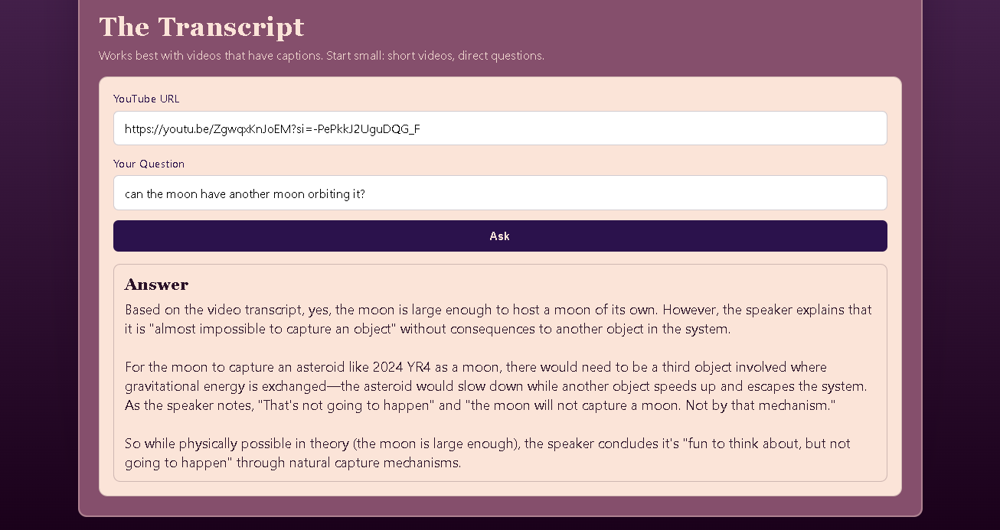
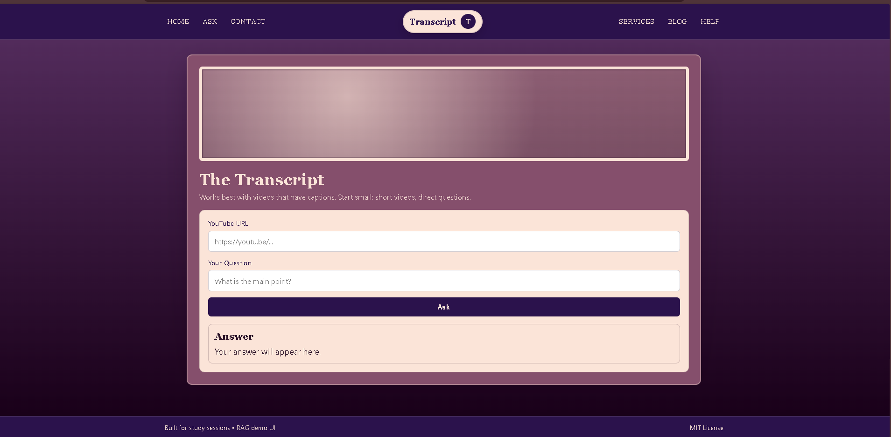

# YouTube Transcript QA (RAG) - AI-Powered Video Intelligence

## 1. Job Title / Project Name
**AI Engineer / Full-Stack Developer** – YouTube RAG QA (Retrieval-Augmented Generation for Video Content)

---

## 2. Introduction
YouTube RAG QA is a full-stack AI application that enables intelligent question-answering grounded in YouTube video transcripts. Using a Retrieval-Augmented Generation (RAG) pipeline, the application fetches video transcripts, chunks and embeds them, performs semantic similarity search, and generates contextually accurate answers—all without hallucination. Built with a modern, secure architecture, it allows users to ask questions about any YouTube video and receive answers directly sourced from the video content, while maintaining API security through backend proxying.

---

## 3. Skills
- **Backend Development**: FastAPI (Python), Uvicorn ASGI server, async request handling
- **Frontend Development**: HTML5, CSS3, JavaScript (ES6+), responsive design
- **Cloud & Deployment**: Hugging Face Spaces (Docker), Render, MongoDB Atlas
- **Database**: MongoDB (Atlas) for Q&A history and metadata logging
- **AI/ML Integration**: RAG pipeline implementation, semantic embeddings, vector similarity search
- **Vector Search & Retrieval**: FAISS (Facebook AI Similarity Search), sentence-transformers embeddings
- **NLP Pipeline**: YouTube transcript extraction, text chunking, token management
- **API Design**: RESTful endpoints, CORS handling, async POST/GET endpoints, form data handling
- **Security**: Environment variable management, API token protection, proxy support for YouTube requests
- **DevOps**: Docker containerization, environment configuration, proxy configuration, secrets management
- **Python Libraries**: LangChain text splitters, sentence-transformers, FAISS, pymongo, httpx

---

## 4. Deliverables
✅ **Frontend** – Single-page application with:
   - YouTube URL input field for video selection
   - Question textarea for user queries
   - Real-time answer streaming and display
   - Q&A history browser (optional: MongoDB integration)
   - Responsive design with clean, minimal UI
   - Error handling with user-friendly messages

✅ **FastAPI Backend**:
   - `GET /` – Serves the main HTML interface
   - `POST /ask` – Core endpoint that:
     * Extracts YouTube transcript via YouTubeTranscriptApi
     * Chunks transcript using LangChain's RecursiveCharacterTextSplitter
     * Embeds chunks using sentence-transformers (all-MiniLM-L6-v2)
     * Performs FAISS similarity search for top-k relevant chunks
     * Generates answer using Hugging Face Router (configurable model)
     * Logs question, answer, video URL, and timestamp to MongoDB
     * Returns structured JSON response with answer and metadata
   - CORS middleware for cross-origin browser requests
   - Static file serving for CSS and JavaScript
   - Async model warmup on startup for reduced latency
   - Secure environment variable handling (HF_TOKEN never exposed to frontend)

✅ **RAG Pipeline Components**:
   - **Transcript Extraction**: YouTube Transcript API with proxy support (Webshare, custom proxies)
   - **Text Chunking**: LangChain RecursiveCharacterTextSplitter with configurable chunk size/overlap
   - **Embedding Generation**: Sentence-Transformers (all-MiniLM-L6-v2) for semantic representations
   - **Vector Search**: FAISS in-memory similarity search for retrieval of relevant chunks
   - **Answer Generation**: Hugging Face Inference API with configurable LLM (default: Kimi-K2.5, google/flan-t5-base)
   - **Context Injection**: Retrieved chunks fed to LLM via prompt engineering for grounded answers

✅ **Database Integration**:
   - MongoDB Atlas for persistent storage of:
     * User questions
     * Generated answers
     * Source YouTube URLs
     * Timestamps for query tracking
     * Video metadata (optional)
   - History retrieval for engagement analytics

✅ **Configuration & Deployment**:
   - `.env` file management with required tokens and database credentials
   - Docker containerization for consistent deployment across environments
   - Hugging Face Spaces deployment with automatic scaling
   - Render, Modal, or cloud platform compatibility
   - Proxy configuration support for IP-blocked YouTube requests

✅ **Documentation**:
   - Complete project structure documentation
   - Step-by-step setup and installation guide
   - Environment variable configuration guide
   - Deployment instructions for multiple platforms
   - Troubleshooting guide for common issues
   - RAG pipeline architecture explanation
   - Proxy setup guide for YouTube transcript extraction

---

## 5. Live Project Link
🔗 **Deployed Application**: *[Your deployment URL here – update with live deployment]*

The application is ready for deployment on:
- Hugging Face Spaces (fully containerized with Docker)
- Render.com (Python web service with MongoDB)
- Modal, AWS Lambda, or other serverless platforms

---

## 6. GitHub Project Link
🐙 **Repository**: <a href="https://github.com/Lily010304/Youtube_RAG_QA">https://github.com/Lily010304/Youtube_RAG_QA</a>

---

## 7. Project Images



---

## Technical Architecture Highlights

### Why This Architecture?

The project follows a **secure, modular RAG architecture**:

1. **Frontend (Browser)** – Clean, minimal interface
   - Collects YouTube URL and user question
   - Communicates only with backend via POST requests
   - Never touches API keys or database credentials
   - Displays answers and Q&A history in real-time

2. **Backend (FastAPI)** – Orchestrates the RAG pipeline
   - Extracts transcripts securely (handles YouTube blocking with proxies)
   - Manages embeddings and vector search in-memory with FAISS
   - Calls Hugging Face Inference API on behalf of frontend
   - Logs all interactions to MongoDB for analytics
   - Keeps `HF_TOKEN` and `MONGO_URI` confidential on the server

3. **Vector Database (FAISS)** – In-memory similarity search
   - Creates dense vector embeddings from transcript chunks
   - Performs fast, approximate nearest-neighbor search
   - Retrieves contextually relevant chunks for LLM input

4. **AI Model Layer** – Hugging Face Inference API
   - Uses configurable LLM (Kimi-K2.5, flan-t5, Mistral, etc.)
   - Generates answers grounded in retrieved transcript chunks
   - Prevents hallucinations through retrieval-based context

5. **Data Persistence (MongoDB)** – Query history and analytics
   - Stores Q&A pairs with timestamps
   - Enables user history tracking
   - Supports future engagement analytics

### Key Technologies

| Component | Technology |
|-----------|------------|
| Frontend | HTML5 + Vanilla JavaScript |
| CSS Framework | Vanilla CSS (responsive, minimal) |
| Backend Framework | FastAPI (Python 3.11+) |
| ASGI Server | Uvicorn |
| Transcript Extraction | YouTubeTranscriptApi |
| Text Processing | LangChain text splitters |
| Embeddings | Sentence-Transformers (all-MiniLM-L6-v2) |
| Vector Search | FAISS (CPU) |
| LLM Inference | Hugging Face Inference API |
| Database | MongoDB Atlas |
| Deployment | Hugging Face Spaces, Render, Modal |
| Containerization | Docker |
| Configuration | Python-dotenv |

### RAG Pipeline Flow

```
YouTube URL
    ↓
[Extract Transcript] → YouTubeTranscriptApi
    ↓
[Chunk Text] → LangChain RecursiveCharacterTextSplitter
    ↓
[Generate Embeddings] → Sentence-Transformers (all-MiniLM-L6-v2)
    ↓
[Index Vectors] → FAISS
    ↓
User Question
    ↓
[Embed Question] → Same embedding model
    ↓
[Retrieve Top-K] → FAISS similarity search
    ↓
[Generate Answer] → Hugging Face LLM + Retrieved context
    ↓
[Log to Database] → MongoDB Atlas
    ↓
Answer Response
```

---

## What Makes This Project Stand Out

🎯 **Grounded AI Answers**: Unlike generic chatbots, answers are strictly grounded in video content—no hallucinations, only facts from the transcript.

🔐 **Security-First Design**: API tokens (HF_TOKEN, MONGO_URI) remain on the backend; frontend communicates through secure, proxy-protected channels.

⚡ **Fast Vector Search**: FAISS enables sub-second similarity search over thousands of transcript chunks, reducing latency to milliseconds.

🌍 **Global Accessibility**: Built-in proxy support (Webshare, custom proxies) handles YouTube IP blocking in restricted regions.

🤖 **Flexible LLM Integration**: Easily swap between different Hugging Face models without changing core code—from lightweight (flan-t5) to powerful (Mistral, Kimi).

📊 **Analytics-Ready**: MongoDB integration tracks every query for user behavior analysis, popular questions, and model performance.

🎨 **Clean Architecture**: Modular design with separate concerns—transcript extraction, embedding, retrieval, and generation are decoupled and testable.

📚 **Production-Ready**: Docker containerization, environment management, error handling, and logging prepared for immediate cloud deployment.

---

## Getting Started (For Reviewers & Users)

### Quick Start

1. **Clone the Repository**:
   ```bash
   git clone https://github.com/Lily010304/Youtube_RAG_QA.git
   cd Youtube_RAG_QA
   ```

2. **Set Up Environment**:
   ```bash
   python -m venv venv
   source venv/bin/activate  # On Windows: venv\Scripts\Activate.ps1
   pip install -r app/requirements.txt
   ```

3. **Configure Environment Variables** (create `.env` in project root):
   ```env
   MONGO_URI=mongodb+srv://<user>:<pass>@<cluster>/?retryWrites=true&w=majority
   MONGO_DB=youtube_rag
   MONGO_QA_COLLECTION=queries
   HF_TOKEN=hf_xxxxxxxxxxxxx
   GEN_MODEL_ID=google/flan-t5-base  # or moonshotai/Kimi-K2.5
   ```

4. **Run the Application**:
   ```bash
   python -m uvicorn --app-dir . app.backend.app:app --reload --host 127.0.0.1 --port 8000
   ```

5. **Open in Browser**: http://127.0.0.1:8000

6. **Ask Questions**:
   - Paste a YouTube URL (e.g., https://www.youtube.com/watch?v=dQw4w9WgXcQ)
   - Type your question (e.g., "What is the main topic of this video?")
   - Click "Ask" and wait for the grounded answer

### Optional: Proxy Configuration (For YouTube Access)

If YouTube blocks your IP:

**Using Webshare Proxy**:
```env
WEBSHARE_PROXY_USERNAME=your_username
WEBSHARE_PROXY_PASSWORD=your_password
WEBSHARE_PROXY_LOCATIONS=us,de  # Optional: country codes
```

**Using Custom Proxy**:
```env
YT_HTTP_PROXY_URL=http://proxy.example.com:8080
YT_HTTPS_PROXY_URL=https://proxy.example.com:8080
```

### Deployment

#### Deploy to Hugging Face Spaces
1. Create a new Space on Hugging Face
2. Select "Docker" as the Space SDK
3. Push your repository (includes Dockerfile)
4. Set environment variables in Space settings
5. Space will auto-deploy and restart on updates

#### Deploy to Render.com
1. Connect your GitHub repository to Render
2. Create a new Web Service
3. Set Build command: `pip install -r app/requirements.txt`
4. Set Start command: `uvicorn --app-dir . app.backend.app:app --host 0.0.0.0 --port 8000`
5. Add environment variables in Service settings
6. Deploy!

---

## Architecture Diagram

```
┌─────────────────────────────────────────────────────────────┐
│                      User Browser                            │
│  ┌───────────────────────────────────────────────────────┐  │
│  │         HTML Interface (index.html)                   │  │
│  │  - URL Input                                          │  │
│  │  - Question Textarea                                 │  │
│  │  - Answer Display                                    │  │
│  └───────────────────────────────────────────────────────┘  │
└────────────────┬──────────────────────────────────────────────┘
                 │ CORS-Protected HTTP
                 ▼
┌─────────────────────────────────────────────────────────────┐
│              FastAPI Backend (Python)                        │
│  ┌───────────────────────────────────────────────────────┐  │
│  │  POST /ask Endpoint                                   │  │
│  │  - Parse URL & Question                              │  │
│  │  - Call generate_answer()                            │  │
│  │  - Save to MongoDB                                   │  │
│  └───────────────────────────────────────────────────────┘  │
└────┬─────────────────┬──────────────────────┬────────────────┘
     │                 │                      │
     ▼                 ▼                      ▼
┌──────────────┐  ┌──────────────┐  ┌──────────────┐
│   YouTube    │  │ FAISS Index  │  │  MongoDB     │
│ (via proxy)  │  │  + Vector    │  │  Atlas       │
│              │  │  Embeddings  │  │              │
│ Transcript   │  │              │  │ Q&A History  │
│ Extraction   │  │              │  │ & Analytics  │
└──────────────┘  └──────────────┘  └──────────────┘
                        ▲
                        │
                   Sentence-Transformers
                   (all-MiniLM-L6-v2)
                        │
                        ▼
            ┌──────────────────────────┐
            │ Hugging Face Inference   │
            │ API                      │
            │ (LLM Generation)         │
            │ (Kimi-K2.5, flan-t5)     │
            └──────────────────────────┘
```

---

## Project Statistics

- **Python Version**: 3.11+
- **Backend Framework**: FastAPI
- **Total Dependencies**: ~15 core packages
- **API Endpoints**: 2 main routes (GET /, POST /ask)
- **Database**: MongoDB (scalable, no size limit)
- **Vector Search**: FAISS (in-memory, millisecond latency)
- **Embedding Model**: sentence-transformers (384 dims)
- **Supported LLMs**: Any Hugging Face model via Inference API

---

## Known Limitations & Solutions

| Issue | Cause | Solution |
|-------|-------|----------|
| YouTube blocked by IP | Regional restrictions | Use proxy config (Webshare, custom) |
| Large transcript timeouts | Processing > 30 min videos | Reduce chunk count or use streaming |
| High latency | Cold start + embedding gen | Model warmup on startup, caching |
| Rate limiting | Hugging Face API quotas | Upgrade HF subscription or use cached embeddings |
| No video support | Requires transcripts only | Won't work on audio-only or unscripted content |

---

## Future Enhancements

🚀 **Planned Features**:
- Streaming answer generation for faster UX
- Multi-video cross-reference queries
- User authentication and personalized history
- Caching layer for repeated queries
- Advanced retrieval: hybrid search (BM25 + semantic)
- Fine-tuned embedding models specific to video domain
- Web search integration for supplemental context
- Answer explanations with quoted transcript snippets
- Batch processing for multiple videos
- Advanced analytics dashboard

---

## Contact & Support

For questions, issues, or feature requests:
- **GitHub Issues**: <a href="https://github.com/Lily010304/Youtube_RAG_QA/issues">Open an Issue</a>
- **GitHub Discussions**: <a href="https://github.com/Lily010304/Youtube_RAG_QA/discussions">Join the Discussion</a>

---

**Status**: Active development  
**Last Updated**: 2026-06-11  
**License**: MIT (or as specified in repository)  
**Contributors**: Open to contributions! 🎉
